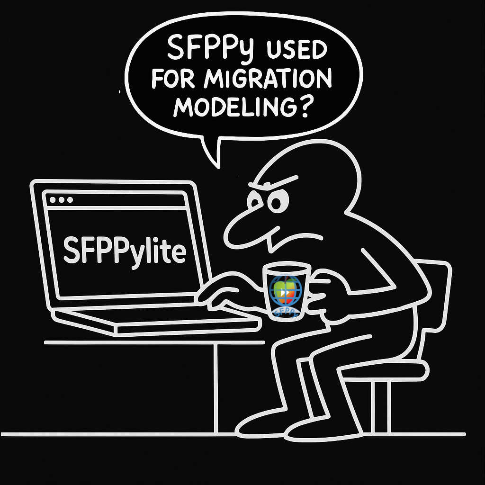
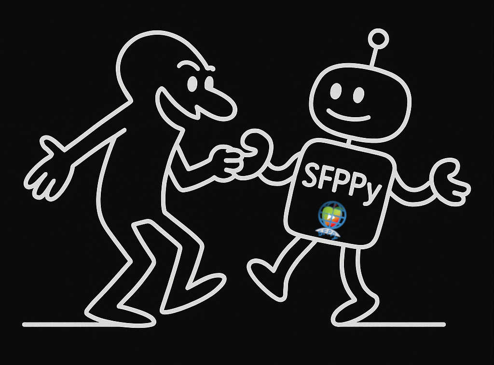
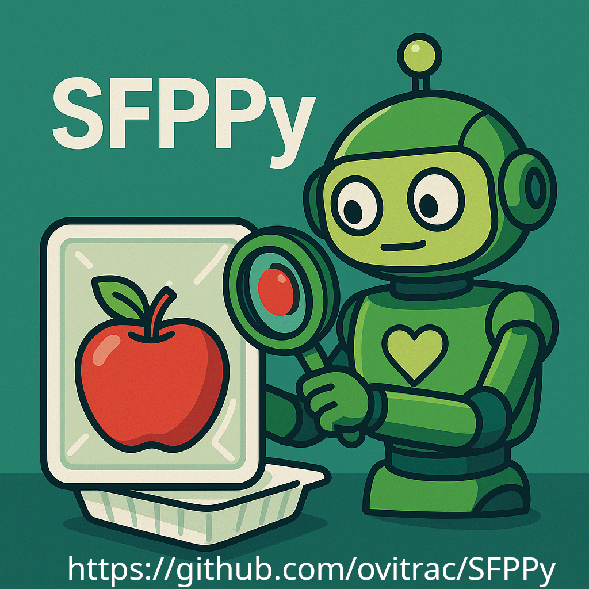

# **🐍 SFPPy-Lite 🌐**

|  | This project is part of the  [Generative Simulation](https://github.com/ovitrac/generativeSimulation) demonstrators | Say it. Simulate it with AI. |  |
| ----------------------------------------------- | ------------------------------------------------------------ | --------------------------------- | -----------------------------------------------------------: |

---

---

> 🍏⏩🍎 **SFPPy**: *A Python Framework for Food Contact Compliance & Risk Assessment*  
>
> |  |    🔥A custom AI assistant 🤖 extensively trained on **SFPPy** 🏋🏻. It helps you explore and use the framework: from the **principles of migration modeling** ⚙️ to **first simulations** 📈, **regulatory compliance** ✅, **interpretation** 📊, and **reporting**📝. |
> | :----------------------------------------------------------: | :----------------------------------------------------------- |

### 🚀 SFPPyLite

**No installation. Runs entirely in your browser. Try it now✨:**

> 🟢 Status update: **Production-ready** with full support for SFPPy notebooks  
> ✅ Complete support for simulation, plotting, curve fitting, and export to PDF/XLSX/CSV  
> 🌍 Integrated databases: EU Regulation Annex I, US FDA FCN lists, Chinese positive lists — ~1300 substances included with toxicological assessment   
> 📦 Runs seamlessly in-browser — no setup needed, fully compatible with modern tablets  
> 🗃️ Files persist in your browser between sessions — drag & drop your own files anytime   
> 🔄 Automatically stays up to date with the latest data and features 

---

### 🚀 What is SFPPy-Lite?

🌐 **SFPPy-Lite** is a **lightweight (30 MB), browser-based preview** of the full **SFPPy framework**.
 It is built on [**JupyterLite**](https://jupyterlite.readthedocs.io/), and runs Python entirely in the browser using [**Pyodide**](https://pyodide.org/) (WebAssembly-based).

You can explore and use **SFPPy’s core functionalities** **instantly** — with **no installation required** and **nothing to configure**.
 <ins>Current performance is impressively close to that of a native desktop application.</ins>

---

### 🍏⏩🍎 Access the Full SFPPy Framework

---

### ـــــــــــــــﮩ٨ـStatus: moved from 🚧 *Demo* to 🟢 *Ready for Production*

> [!WARNING]
> 💡 **Start Here**: Launch the notebook `demo.ipynb` to begin (or watch the [video walkthrough](https://ovitrac.github.io/SFPPy/SFPPylite_demo.html)).  
>
> ✅ All components are now operational, including notebooks under 📂**Notebooks/**, as well as **graphical interfaces**, **simulation**, **plotting**, **curve fitting**, and **export to PDF/XLSX**.  
>
> ⏱️ **SFPPyLite** runs at approximately half the speed 🌗 of the desktop version. However, all notebooks execute in under one minute. This performance is sufficient for practical use, with the caveat that **native in-browser execution** (via Pyodide/WebAssembly) imposes some limitations.  
>
> 🪧🌐  🇪🇺 **Annex I of Regulation (EU) 10/2011**, 🇺🇸 **US FDA Food Contact Notification list** and 🇨🇳 **Appendices A1-A7 of Standard GB 9685-2016** are included and searchable.  
>
> 🚩 **PubChem substance retrieval** is *partially functional*: the module `private.pubchemspy` has been adapted for JupyterLite, but **write operations may fail** due to incompatibilities between **Pyodide** and **IndexedDB**, the browser’s internal filesystem.  
>
> ❌ **ToxTree** is not supported, as it cannot currently be compiled to **WebAssembly**.  
>
> 🗃️ Files (notebooks, scripts, datasets, etc.) are **persistently stored** in your browser across sessions. Your data remains safe unless using **private/incognito mode**. You can **drop files** into the interface or **download/export** any file as needed.
>
> 

---

### 🤖💻🌐 Comparison of `SFPPy` Across Platforms: Desktop, Lite, and Google Colab

🧭 **Find the platform that fits best your requirements: ease, confidentiality, archiving, assistance**.

*All usage options are free of charge.*

|                                    Feature / Capability | 💫💻 **SFPPy (Desktop)**                            | 🌐 **SFPPyLite (Browser)**                             | ☁️ **SFPPy in Google Colab**              |
| ------------------------------------------------------: | ------------------------------------------------- | ----------------------------------------------------- | ---------------------------------------- |
|   **AI-powered assistance (*e.g.* for interpretation)** | ❌ Not available or use **Jupyter Lab** extensions | ❌ Not available or use external extensions            | ✅ Available (via Gemini)                 |
|                               **Installation required** | Yes (Python + dependencies)                       | ❌ No installation (runs in-browser)                   | ❌ No installation (via bootstrap script) |
|                            **Notebook execution speed** | Full native performance                           | ⏱️ ~2× slower (WebAssembly limits)                     | ✅ Fast (depends on Google backend)       |
|                **Simulation resolution / memory usage** | High (limited by system resources)                | Reduced for complex models (browser memory limits)    | High (usually)                           |
|               **Graphical plotting (SVG, PNG, Retina)** | ✅ Full support                                    | ✅ Full support                                        | ✅ Full support                           |
|                    **Curve fitting and modeling tools** | ✅ Available                                       | ✅ Available                                           | ✅ Available                              |
|                     **Export formats (PDF, XLSX, CSV)** | ✅ Full support                                    | ✅ Full support                                        | ✅ Full support                           |
|                   **Annex I (Regulation (EU) 10/2011)** | ✅ Integrated and queryable                        | ✅ Integrated and queryable                            | ✅ Integrated and queryable               |
|                              **US FDA FCN list (2025)** | ✅ Integrated and queryable                        | ✅ Integrated and queryable                            | ✅ Integrated and queryable               |
| **Appendices A1-A7 (Chinese standard GB GB 9685-2016)** | ✅ Integrated and queryable                        | ✅ Integrated and queryable                            | ✅ Integrated and queryable               |
|                         **PubChem substance retrieval** | ✅ Fully functional                                | ⚠️ Partial (read-only, limited write support)          | ✅ Full access                            |
|                            **Toxicological assessment** | ✅ Fully functional                                | ⚠️ Cramer class and alerts for shipped substances only | ✅ Fully functional                       |
|                                 **ToxTree integration** | ✅ Supported                                       | ❌ Not supported (WebAssembly incompatible)            | ✅ Supported                              |
|         **Self-archiving and reporting (PDF + .ipynb)** | ✅ Automatic or manual                             | ❌ Not supported                                       | ✅ Manual (download/export)               |
|             **Session persistence / multi-tab support** | Depends on setup                                  | ✅ Fully supported (via IndexedDB)                     | ❌ Not persistent between sessions        |
|                                       **Offline usage** | ✅ Once installed                                  | ✅ After initial load (cached in browser)              | ❌ Requires internet                      |
|                         **Custom file upload/download** | ✅ OS-level                                        | ✅ Browser-based (drag & drop or panel)                | ✅ Upload/download via Colab UI           |
|                                **🛠️ Updating Mechanism** | 🔁 Manual updates via Git or package manager       | 🔄 Always updated to latest sources (on load)          | 🔄 Bootstrapped from latest version       |

---

### 💫 Requirements

🌐**SFPPy-Lite** has been tested successfully on:

- ✅ Firefox 90+
- ✅ Chrome / Chromium 89+
- ✅ Safari  (Mac OS, IOS)
- ❓ ❌ Other Mobile browsers: not fully supported (to be tested case-by-case)

---

### 🧰 Powered by

- [JupyterLite](https://jupyterlite.readthedocs.io/)
- [Pyodide](https://pyodide.org/)
- [SFPPy](https://github.com/ovitrac/SFPPy) – Full Python framework

---

### 📬 Feedback?

💬 Found a bug or have suggestions? [Open an issue](https://github.com/ovitrac/SFPPy/issues) or reach out via email — feedback is welcome!

---

### 🍏⏩🍎 `SFPPy`: Built for AI. Ready for Simulation.

🤖 +⚖️ *Can robots like **GPT** really evaluate food contact compliance using **SFPPy**?* *Check out the intriguing answers from two GPT-powered experts [here](https://github.com/ovitrac/SFPPy/wiki/🤖-Ask-GPT-to-demonstrate-compliance-with-SFPPy)!*.

| <small>☝🏻Click on the image to learn more.</small> | 🔮**Explore the future.**  Coding is a language—and with generative AI, we can bridge real-world problems to simulation-ready computer code. Python is the medium of choice, as it remains the most fluent language for AI systems.  ╰┈➤***Prompts accelerate simulation prototyping** and the design of complex case scenarios. Thanks to the abstract nature of this interface, there are no constraints on the level of complexity: it operates independently of the underlying mathematical or numerical methods.*  |
| :----------------------------------------------------------- | :----------------------------------------------------------- |
| <small>Credits: [Olivier Vitrac](mailto:olivier.vitrac@gmail.com)</small> | 🤔**With respect to regulatory compliance**, AI assists you by generating informed scenarios and interpretations—but **you remain the decision-maker**.  |

