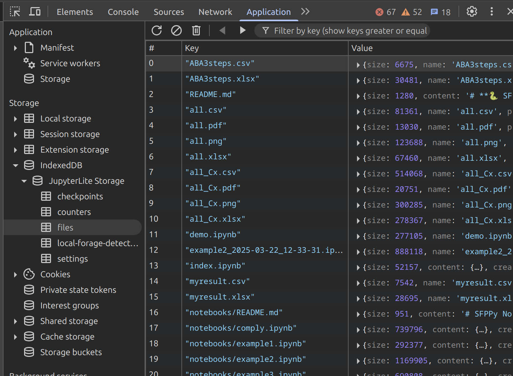

  <small>🍏⏩🍎 SFPPylite🌐 - directly in your browser</small>
  

    
    

      v1.40
      <a href="mailto:olivier.vitrac@gmail.com" title="E-mail the author" style="margin-left: 8px; font-size: 20px;">📩</a>
    

  

## **🐍 SFPPy-Lite 🌐**

> **SFPPy**: A Python Framework for Food Contact Compliance & Risk Assessment  
> 🍏⏩🍎 **SFPPy-Lite** runs **entirely in your browser** — no server, no install, fully operational!

<video width="100%" controls  autoplay loop muted playsinline">
  <source src="https://github.com/ovitrac/SFPPylite/raw/refs/heads/main/extra/videos/SFPPylite.mp4" type="video/mp4">
  Your browser does not support the video tag.
</video>

### ـــــــــــــــﮩ٨ـStatus: moved from 🚧 *Demo* to 🟢 *Ready for Production*

> [!WARNING]
>
>
> 💡 **Start Here**: Launch the notebook `demo.ipynb` to begin (or watch the [video walkthrough](https://ovitrac.github.io/SFPPy/SFPPylite_demo.html)).  
>
> ✅ All components are now operational, including notebooks under 📂**Notebooks/**, as well as **graphical interfaces**, **simulation**, **plotting**, **curve fitting**, and **export to PDF/XLSX**.  
>
> ⏱️ **SFPPyLite** runs at approximately half the speed 🌗 of the desktop version. However, all notebooks execute in under one minute. This performance is sufficient for practical use, with the caveat that **native in-browser execution** (via Pyodide/WebAssembly) imposes some limitations.  
>
> 🪧🌐 The full 🇪🇺 **Annex I of Regulation (EU) 10/2011** is included and searchable.  
>
> 🚩 **PubChem substance retrieval** is *partially functional*: the module `private.pubchemspy` has been adapted for JupyterLite, but **write operations may fail** due to incompatibilities between **Pyodide** and **IndexedDB**, the browser’s internal filesystem.  
>
> ❌ **ToxTree** is not supported, as it cannot currently be compiled to **WebAssembly**.  
>
> 

### 💾 Storage in SFPPylite

> [!NOTE]
>
> 🗃️ Files (notebooks, scripts, data, etc.) are **persistently stored** across sessions in your browser. **Your data is safe**, unless you're working in **incognito/private mode**. You can also **drop your own files** into the left panel or **download existing ones**.  
> ⚙️Press <kbd>CTRL+J</kbd> to access development tools in your browser and select Application to see the the JupyterLite Storage. 🗑️ It can be reinitialized there if needed.
>
> 
>
> 🔔**SFPPylite files** included in the distribution (Python files, Json databases, notebooks) are not saved in the IndexDB database.  They are stored in the static app bundle (📂**content/** folder ) and mounted as 📂**/** in **JupyterLite**, backed by **Emscripten's MEMFS or IDBFS** (via `pyodide`).  
>
> 1. **The prebuilt version is not protected** — it is treated as just another file once the app is loaded.
> 2. **The original content is lost** in the current session, and on refresh, **the user version persists** (persistent storage is enabled by default).
> 3. **Even built-in notebooks can be permanently replaced**, unless the user clears their browser storage.
> 4. **Even if the app was updated** with a new version of the file, the **old user version takes precedence**.
>
> ❗⚠️ Remove the files you modified from the **SFPPylite bundle** (i.e., the overrides you did) if you want the benefit of regular updates. 

### 🍏⏩🍎 Access the Full SFPPy Framework

  🍏⏩🍎 <strong>SFPPy for Food Contact Compliance and Risk Assessment</strong> 
  Contact <a href="mailto:olivier.vitrac@gmail.com" style="color: #fff; text-decoration: underline;">Olivier Vitrac</a> for questions |
  <a href="https://github.com/ovitrac/SFPPy" style="color: #fff; text-decoration: underline;">Website</a> |
  <a href="https://ovitrac.github.io/SFPPy/" style="color: #fff; text-decoration: underline;">Documentation</a>

